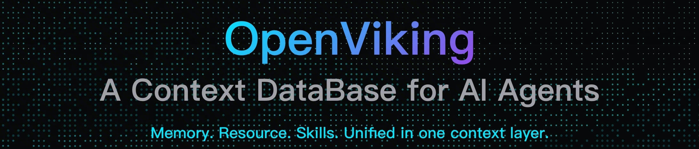

<div align="center">

<picture>
  
</picture>

### OpenViking：为 AI Agent 而生的上下文数据库

[English](README.md) / 中文

<a href="https://www.openviking.ai">官网</a> · <a href="https://github.com/volcengine/OpenViking">GitHub</a> · <a href="https://github.com/volcengine/OpenViking/issues">问题反馈</a> · <a href="https://www.openviking.ai/docs">文档</a>

[![][release-shield]][release-link]
[![][github-stars-shield]][github-stars-link]
[![][github-issues-shield]][github-issues-shield-link]
[![][github-contributors-shield]][github-contributors-link]
[![][license-shield]][license-shield-link]
[![][last-commit-shield]][last-commit-shield-link]

👋 加入我们的社区讨论

📱 <a href="./docs/zh/about/01-about-us.md#飞书群">飞书群</a> · <a href="./docs/zh/about/01-about-us.md#微信群">微信群</a> · <a href="https://discord.com/invite/eHvx8E9XF3">Discord</a> · <a href="https://x.com/openvikingai">X</a>

</div>

---

## 项目概览

### Agent 开发面临的挑战

在 AI 时代，数据易得，但高质量的上下文却难求。构建 AI Agent 时，开发者经常遇到这些挑战：
- **上下文碎片化**：记忆在代码里，资源在向量库，技能散落各处，难以统一管理
- **所需上下文猛增**：Agent 的长程任务在每次执行时都会产出上下文，简单的截断或压缩会导致信息损失
- **检索效果不佳**：传统 RAG 是平铺式存储，缺乏全局视野，难以理解信息的完整语境
- **上下文不可观测**：传统 RAG 隐式的检索链路如同黑箱，出错时难以调试
- **记忆迭代有限**：目前记忆只是用户记忆的记录，缺乏 Agent 相关的任务记忆

### OpenViking 解决方案

OpenViking 是一个开源的、专为 AI Agent 设计的上下文数据库。

我们旨在为 Agent 定义一套极简的上下文交互范式，让开发者彻底告别上下文管理的烦恼。 OpenViking 摒弃了传统 RAG 的碎片化向量存储模式，创新性地采用 **“文件系统范式”**，将 Agent 所需的记忆、资源和技能进行统一的结构化组织。

通过 OpenViking，开发者可以像管理本地文件一样构建 Agent 的大脑：

- **文件系统管理范式 → 解决碎片化问题**：基于文件系统范式，将记忆、资源、技能进行统一上下文管理
- **分层上下文按需加载 → 降低 Token 消耗**：L0/L1/L2 三层结构，按需加载，大幅节省成本
- **目录递归检索 → 提升检索效果**：支持原生文件系统检索方式，融合目录定位与语义搜索，实现递归式精准上下文获取
- **可视化检索轨迹 → 上下文可观测**：支持可视化目录检索轨迹，让用户能够清晰观测问题根源并指导检索逻辑优化
- **会话自动管理 → 上下文自迭代**：自动压缩对话中的内容、资源引用、工具调用等信息，提取长期记忆，让 Agent 越用越聪明

---

## 快速上手

### 前置要求

在开始使用 OpenViking 之前，请确保您的环境满足以下要求：

- **Python 版本**：3.9 或更高版本
- **操作系统**：Linux、macOS、Windows
- **网络连接**：需要稳定的网络连接（用于下载依赖包和访问模型服务）

### 1. 安装 OpenViking

```bash
pip install openviking
```

### 2. 模型准备

OpenViking 需要以下模型能力：
- **VLM 模型**：用于图像和内容理解
- **Embedding 模型**：用于向量化和语义检索

OpenViking 支持多种模型服务：
- **OpenAI 模型**：支持 GPT-4V 等 VLM 模型和 OpenAI Embedding 模型
- **火山引擎（豆包模型）**：推荐使用，成本低、性能好，新用户有免费额度。如需购买和开通，请参考：[火山引擎购买指南](./docs/zh/guides/02-volcengine-purchase-guide.md)
- **其他自定义模型服务**：支持兼容 OpenAI API 格式的模型服务

### 3. 配置环境

#### 配置文件模版

创建配置文件 `~/.openviking/ov.conf`：

```json
{
  "embedding": {
    "dense": {
      "api_base" : "<api-endpoint>",   // API 服务端点地址
      "api_key"  : "<your-api-key>",   // 模型服务的 API 密钥
      "provider" : "<provider-type>",  // 提供商类型（volcengine 或 openai）
      "dimension": 1024,               // 向量维度
      "model"    : "<model-name>"      // Embedding 模型名称（如 doubao-embedding-vision-250615 或 text-embedding-3-large）
    }
  },
  "vlm": {
    "api_base" : "<api-endpoint>",     // API 服务端点地址
    "api_key"  : "<your-api-key>",     // 模型服务的 API 密钥
    "provider" : "<provider-type>",    // 提供商类型（volcengine 或 openai）
    "model"    : "<model-name>"        // VLM 模型名称（如 doubao-seed-1-8-251228 或 gpt-4-vision-preview）
  }
}
```

#### 配置示例

👇 根据你使用的模型服务，展开查看对应的配置示例：

<details>
<summary><b>示例 1：使用火山引擎（豆包模型）</b></summary>

```json
{
  "embedding": {
    "dense": {
      "api_base" : "https://ark.cn-beijing.volces.com/api/v3",
      "api_key"  : "your-volcengine-api-key",
      "provider" : "volcengine",
      "dimension": 1024,
      "model"    : "doubao-embedding-vision-250615"
    }
  },
  "vlm": {
    "api_base" : "https://ark.cn-beijing.volces.com/api/v3",
    "api_key"  : "your-volcengine-api-key",
    "provider" : "volcengine",
    "model"    : "doubao-seed-1-8-251228"
  }
}
```

</details>

<details>
<summary><b>示例 2：使用 OpenAI 模型</b></summary>

```json
{
  "embedding": {
    "dense": {
      "api_base" : "https://api.openai.com/v1",
      "api_key"  : "your-openai-api-key",
      "provider" : "openai",
      "dimension": 3072,
      "model"    : "text-embedding-3-large"
    }
  },
  "vlm": {
    "api_base" : "https://api.openai.com/v1",
    "api_key"  : "your-openai-api-key",
    "provider" : "openai",
    "model"    : "gpt-4-vision-preview"
  }
}
```

</details>

#### 设置环境变量

创建好配置文件后，设置环境变量指向配置文件（Linux/macOS）：

```bash
export OPENVIKING_CONFIG_FILE=~/.openviking/ov.conf
```

Windows 下可使用以下方式之一：

PowerShell：

```powershell
$env:OPENVIKING_CONFIG_FILE = "$HOME/.openviking/ov.conf"
```

命令提示符（cmd.exe）：

```bat
set "OPENVIKING_CONFIG_FILE=%USERPROFILE%\.openviking\ov.conf"
```

> 💡 **提示**：你也可以将配置文件放在其他位置，只需在环境变量中指定正确的路径即可。

### 4. 运行你的第一个示例

> 📝 **前提**：请确保已完成上一步的环境配置

现在让我们运行一个完整的示例，体验 OpenViking 的核心功能。

#### 创建 Python 脚本

创建 `example.py`：

```python
import openviking as ov

# Initialize OpenViking client with data directory
client = ov.SyncOpenViking(path="./data")

try:
    # Initialize the client
    client.initialize()

    # Add resource (supports URL, file, or directory)
    add_result = client.add_resource(
        path="https://raw.githubusercontent.com/volcengine/OpenViking/refs/heads/main/README.md"
    )
    root_uri = add_result['root_uri']

    # Explore the resource tree structure
    ls_result = client.ls(root_uri)
    print(f"Directory structure:\n{ls_result}\n")

    # Use glob to find markdown files
    glob_result = client.glob(pattern="**/*.md", uri=root_uri)
    if glob_result['matches']:
        content = client.read(glob_result['matches'][0])
        print(f"Content preview: {content[:200]}...\n")

    # Wait for semantic processing to complete
    print("Wait for semantic processing...")
    client.wait_processed()

    # Get abstract and overview of the resource
    abstract = client.abstract(root_uri)
    overview = client.overview(root_uri)
    print(f"Abstract:\n{abstract}\n\nOverview:\n{overview}\n")

    # Perform semantic search
    results = client.find("what is openviking", target_uri=root_uri)
    print("Search results:")
    for r in results.resources:
        print(f"  {r.uri} (score: {r.score:.4f})")

    # Close the client
    client.close()

except Exception as e:
    print(f"Error: {e}")
```

#### 运行脚本

```bash
python example.py
```

#### 预期输出

```
Directory structure:
...

Content preview: ...

Wait for semantic processing...
Abstract:
...

Overview:
...

Search results:
  viking://resources/... (score: 0.8523)
  ...
```

恭喜！你已成功运行 OpenViking 🎉

---

## 服务端部署

在生产环境中，我们推荐将 OpenViking 作为独立 HTTP 服务运行，以便为您的 AI Agent 提供持久化、高性能的上下文支持。

🚀 **云端部署OpenViking**：
为了确保存储性能与数据安全，我们推荐使用 **火山引擎云服务器 (ECS)** 结合 veLinux 系统进行部署。我们准备了详细的测试教程，点击下方链接即可快速上手。

👉 **[点击查看：服务端部署与ECS测试文档](./docs/zh/getting-started/03-quickstart-server.md)**

## 核心理念

在成功运行第一个示例后，让我们深入了解 OpenViking 的设计理念。这五大核心理念与前面提到的解决方案一一对应，共同构建了一个完整的上下文管理体系：

### 1. 文件系统管理范式 → 解决碎片化问题

我们不再将上下文视为扁平的文本切片，而是将其统一抽象并组织于一个虚拟文件系统中。无论是记忆、资源还是能力，都会被映射到 `viking://` 协议下的虚拟目录，拥有唯一的 URI。

这种范式赋予了 Agent 前所未有的上下文操控能力，使其能像开发者一样，通过 `ls`、`find` 等标准指令来精确、确定性地定位、浏览和操作信息，让上下文的管理从模糊的语义匹配演变为直观、可追溯的"文件操作"。了解更多：[Viking URI](./docs/zh/concepts/04-viking-uri.md) | [上下文类型](./docs/zh/concepts/02-context-types.md)

```
viking://
├── resources/              # 资源：项目文档、代码库、网页等
│   ├── my_project/
│   │   ├── docs/
│   │   │   ├── api/
│   │   │   └── tutorials/
│   │   └── src/
│   └── ...
├── user/                   # 用户：个人偏好、习惯等
│   └── memories/
│       ├── preferences/
│       │   ├── 写作风格
│       │   └── 编程习惯
│       └── ...
└── agent/                  # Agent：技能、指令、任务记忆等
    ├── skills/
    │   ├── search_code
    │   ├── analyze_data
    │   └── ...
    ├── memories/
    └── instructions/
```

### 2. 分层上下文按需加载 → 降低 Token 消耗

将海量上下文一次性塞入提示词，不仅成本高昂，更容易超出模型窗口并引入噪声。OpenViking 在上下文写入时便自动将其处理为三个层级：
- **L0 (摘要)**：一句话概括，用于快速检索和识别
- **L1 (概述)**：包含核心信息和使用场景，供 Agent 在规划阶段进行决策
- **L2 (详情)**：完整的原始数据，供 Agent 在确有必要时深入读取

了解更多：[上下文分层](./docs/zh/concepts/03-context-layers.md)

```
viking://resources/my_project/
├── .abstract               # L0 层：摘要（~100 tokens）- 快速判断相关性
├── .overview               # L1 层：概览（~2k tokens）- 了解结构和要点
├── docs/
│   ├── .abstract          # 每个目录都有对应的 L0/L1 层
│   ├── .overview
│   ├── api/
│   │   ├── .abstract
│   │   ├── .overview
│   │   ├── auth.md        # L2 层：完整内容 - 按需加载
│   │   └── endpoints.md
│   └── ...
└── src/
    └── ...
```

### 3. 目录递归检索 → 提升检索效果

单一的向量检索难以应对复杂的查询意图。OpenViking 设计了一套创新的**目录递归检索策略**，深度融合多种检索方式：

1. **意图分析**：通过意图分析生成多个检索条件
2. **初始定位**：利用向量检索快速定位初始切片所在的高分目录
3. **精细探索**：在该目录下进行二次检索，并将高分结果更新至候选集合
4. **递归下探**：若目录下仍存在子目录，则逐层递归重复上述二次检索步骤
5. **结果汇总**：最终拿到最相关上下文返回

这种"先锁定高分目录、再精细探索内容"的策略，不仅能找到语义最匹配的片段，更能理解信息所在的完整语境，从而提升检索的全局性与准确性。了解更多：[检索机制](./docs/zh/concepts/07-retrieval.md)

### 4. 可视化检索轨迹 → 上下文可观测

OpenViking 的组织方式采用层次化虚拟文件系统结构，所有上下文均以统一格式整合且每个条目对应唯一 URI（如 `viking://` 路径），打破传统扁平黑箱式管理模式，层次分明易于理解。

检索过程采用目录递归策略，每次检索的目录浏览、文件定位轨迹均被完整留存，能够清晰观测问题根源并指导检索逻辑优化。了解更多：[检索机制](./docs/zh/concepts/07-retrieval.md)

### 5. 会话自动管理 → 上下文自迭代

OpenViking 内置了记忆自迭代闭环。在每次会话结束时，开发者可以主动触发记忆提取机制，系统会异步分析任务执行结果与用户反馈，并自动更新至 User 和 Agent 的记忆目录下。

- **用户记忆更新**：更新用户偏好相关记忆，使 Agent 回应更贴合用户需求
- **Agent 经验积累**：从任务执行经验中提取操作技巧、工具使用经验等核心内容，助力后续任务高效决策

让 Agent 在与世界的交互中"越用越聪明"，实现自我进化。了解更多：[会话管理](./docs/zh/concepts/08-session.md)

---

## 项目架构

OpenViking 项目采用清晰的模块化架构设计，主要目录结构如下：

```
OpenViking/
├── openviking/              # 核心源代码目录
│   ├── core/               # 核心模块：客户端、引擎、文件系统等核心功能
│   ├── models/             # 模型集成：VLM 和 Embedding 模型的封装
│   ├── parse/              # 资源解析：文件解析、资源检测、OVPack 格式处理
│   ├── retrieve/           # 检索模块：语义检索、目录递归检索等
│   ├── storage/            # 存储层：向量数据库、文件系统队列、观察者模式
│   ├── session/            # 会话管理：对话历史、记忆提取等
│   ├── message/            # 消息处理：消息格式化、转换等
│   ├── prompts/            # 提示词模板：各类任务的提示词模板
│   ├── utils/              # 工具函数：配置管理、辅助工具等
│   └── bin/                # 命令行工具
├── docs/                    # 项目文档
│   ├── zh/                 # 中文文档
│   ├── en/                 # 英文文档
│   └── images/             # 文档图片资源
├── examples/                # 使用示例
├── tests/                   # 测试用例
│   ├── client/             # 客户端测试
│   ├── engine/             # 引擎测试
│   ├── integration/        # 集成测试
│   ├── session/            # 会话测试
│   └── vectordb/           # 向量数据库测试
├── src/                     # C++ 扩展模块（高性能索引和存储）
│   ├── common/             # 公共组件
│   ├── index/              # 索引实现
│   └── store/              # 存储实现
├── third_party/             # 第三方依赖
├── pyproject.toml           # Python 项目配置文件
├── setup.py                 # 安装脚本
├── LICENSE                  # 开源协议
├── CONTRIBUTING.md          # 贡献指南
├── AGENT.md                 # Agent 开发指南
└── README.md                # 项目说明文档
```


---

## 进阶阅读

如需了解更多详细信息，请访问我们的[完整文档](./docs/zh/)。

---

## 社区与团队

### 关于我们

OpenViking 是由**字节跳动火山引擎 Viking 团队**发起并维护的开源项目。

Viking 团队专注于非结构化信息处理和智能检索领域，在上下文工程技术方面积累了丰富的商业化实践经验：

- **2019 年**：VikingDB 向量数据库支撑字节内部全业务大规模使用
- **2023 年**：VikingDB 在火山引擎公有云售卖
- **2024 年**：推出面向开发者的产品矩阵：VikingDB 向量数据库、Viking 知识库、Viking 记忆库
- **2025 年**：打造 AI 搜索、vaka 知识助手等上层应用产品
- **2025 年 10 月**：开源 [MineContext](https://github.com/volcengine/MineContext)，主动式 AI 应用探索
- **2026 年 1 月**：开源 OpenViking，为 AI Agent 提供底层上下文数据库支撑

更多详细信息请查看：**[关于我们](./docs/zh/about/01-about-us.md)**

---

### 加入社区

OpenViking 目前还处于早期阶段，有许多需要完善和探索的地方。在此，我们诚挚地邀请每一位对 AI Agent 技术充满热情的开发者：

- 为我们点亮一颗宝贵的 **Star**，给予我们前行的动力
- 访问我们的 [**网站**](https://www.openviking.ai)，了解我们传递的理念，并通过[**文档**](https://www.openviking.ai/docs)使用它，在您的项目中感受它带来的改变，并向我们反馈最真实的体验
- 加入我们的社区，分享您的洞见，帮助解答他人的疑问，共同营造一个开放、互助的技术氛围：
  - 📱 **飞书群**：扫描二维码加入 → [查看二维码](./docs/zh/about/01-about-us.md#飞书群)
  - 💬 **微信群**：添加小助手微信，备注「OpenViking」→ [查看二维码](./docs/zh/about/01-about-us.md#微信群)
  - 🎮 **Discord**：[加入 Discord 服务器](https://discord.com/invite/eHvx8E9XF3)
  - 🐦 **X (Twitter)**：[关注我们的动态](https://x.com/openvikingai)
- 成为我们的**贡献者**，无论是提交一个 Bug 修复，还是贡献一个新功能，您的每一行代码都将是 OpenViking 成长的重要基石

让我们一起，共同定义和构建 AI Agent 上下文管理的未来。旅程已经开始，期待您的加入！

---

### Star 趋势

[](https://www.star-history.com/#volcengine/OpenViking&type=timeline&legend=top-left)

---

## 许可证

本项目采用 Apache License 2.0 开源协议 - 详见 [LICENSE](./LICENSE)


<!-- 链接定义 -->

[release-shield]: https://img.shields.io/github/v/release/volcengine/OpenViking?color=369eff&labelColor=black&logo=github&style=flat-square
[release-link]: https://github.com/volcengine/OpenViking/releases
[license-shield]: https://img.shields.io/badge/license-apache%202.0-white?labelColor=black&style=flat-square
[license-shield-link]: https://github.com/volcengine/OpenViking/blob/main/LICENSE
[last-commit-shield]: https://img.shields.io/github/last-commit/volcengine/OpenViking?color=c4f042&labelColor=black&style=flat-square
[last-commit-shield-link]: https://github.com/volcengine/OpenViking/commits/main
[github-stars-shield]: https://img.shields.io/github/stars/volcengine/OpenViking?labelColor&style=flat-square&color=ffcb47
[github-stars-link]: https://github.com/volcengine/OpenViking
[github-issues-shield]: https://img.shields.io/github/issues/volcengine/OpenViking?labelColor=black&style=flat-square&color=ff80eb
[github-issues-shield-link]: https://github.com/volcengine/OpenViking/issues
[github-contributors-shield]: https://img.shields.io/github/contributors/volcengine/OpenViking?color=c4f042&labelColor=black&style=flat-square
[github-contributors-link]: https://github.com/volcengine/OpenViking/graphs/contributors
