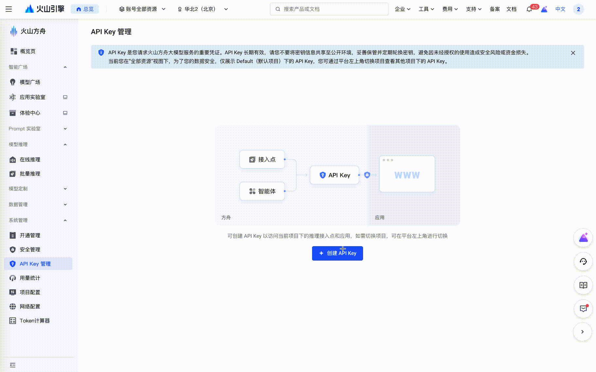
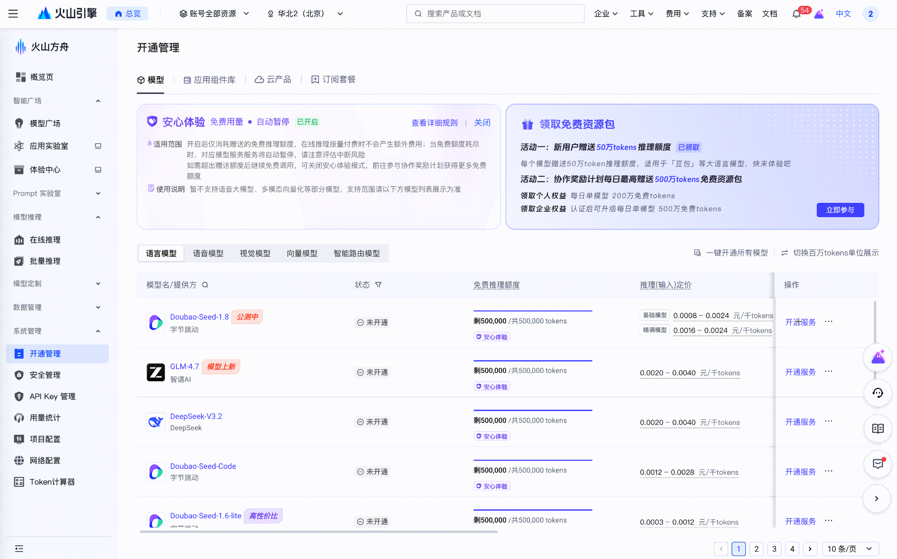
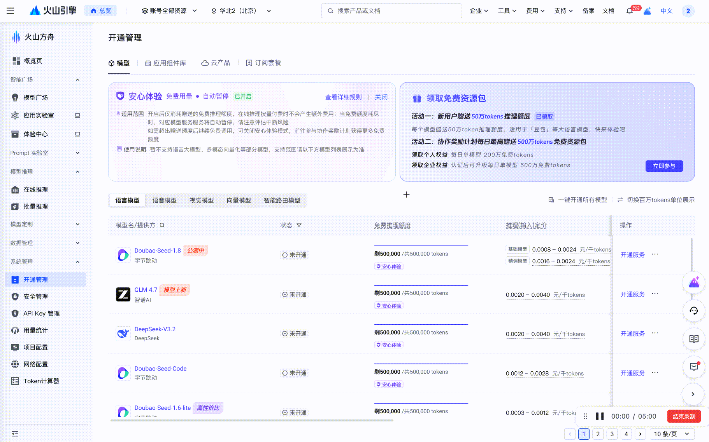

# Volcengine Model Purchase Guide

This guide introduces how to purchase and configure the model services required by OpenViking on Volcengine.

## Overview

OpenViking requires the following model services:

| Model Type | Purpose | Recommended Model |
|------------|---------|-------------------|
| VLM (Vision Language Model) | Content understanding, semantic generation | `doubao-seed-1-8-251228` |
| Embedding | Vectorization, semantic retrieval | `doubao-embedding-vision-250615` |

## Prerequisites

- A valid mobile phone number or email address
- Completed real-name authentication (Individual or Enterprise)

## Purchase Process

### 1. Register an Account

Visit the [Volcengine Official Website](https://www.volcengine.com/):

1. Click "Login/Register" (登录/注册) in the top right corner.
2. Select a registration method (Phone/Email).
3. Complete verification and set a password.
4. Perform real-name authentication.

### 2. Activate Volcano Ark

Volcano Ark is Volcengine's AI model service platform.

#### Access the Console

1. After logging in, enter the [Console](https://console.volcengine.com/).
2. Search for "Volcano Ark" (火山方舟).
3. Click to enter the [Volcano Ark Console](https://console.volcengine.com/ark/region:ark+cn-beijing/model).
4. For first-time use, you need to click "Activate Service" (开通服务) and agree to the agreement.

### 3. Create API Key

Visit: [API Key Management Page](https://console.volcengine.com/ark/region:ark+cn-beijing/apiKey)

All model calls require an API Key.

1. Select **"API Key Management"** (API Key 管理) in the left navigation bar of Volcano Ark.
2. Click **"Create API Key"** (创建 API Key).
3. Copy and save the API Key for subsequent configuration.

<div align="center">

</div>

### 4. Activate VLM Model

Visit: [Model Management Page](https://console.volcengine.com/ark/region:ark+cn-beijing/model)

1. Select **"Provisioning Management"** (开通管理) in the left navigation bar.
2. Select the **"Language Model"** (语言模型) column.
3. Find the **Doubao-Seed-1.8** model.
4. Click the "Activate" (开通) button.
5. Confirm the payment method.

<div align="center">

</div>

After activation, you can use the model ID directly: `doubao-seed-1-8-251228`

### 5. Activate Embedding Model

Visit: [Model Management Page](https://console.volcengine.com/ark/region:ark+cn-beijing/model)

1. Select **"Provisioning Management"** (开通管理) in the left navigation bar.
2. Select the **"Vector Model"** (向量模型) column.
3. Find the **Doubao-Embedding-Vision** model.
4. Click "Activate" (开通).
5. Confirm the payment method.

<div align="center">

</div>

After activation, use the model ID: `doubao-embedding-vision-250615`

## Configure OpenViking

### Configuration Template

Create an `~/.openviking/ov.conf` file using the following template:

```json
{
  "vlm": {
    "provider": "<provider-type>",
    "api_key": "<your-api-key>",
    "model": "<model-id>",
    "api_base": "<api-endpoint>",
    "temperature": <temperature-value>,
    "max_retries": <retry-count>
  },
  "embedding": {
    "dense": {
      "provider": "<provider-type>",
      "api_key": "<your-api-key>",
      "model": "<model-id>",
      "api_base": "<api-endpoint>",
      "dimension": <vector-dimension>,
      "input": "<input-type>"
    }
  }
}
```

### Configuration Fields Explanation

#### VLM Configuration Fields

| Field | Type | Required | Description |
|-------|------|----------|-------------|
| `provider` | string | Yes | Model service provider, fill in `"volcengine"` for Volcengine |
| `api_key` | string | Yes | Volcano Ark API Key |
| `model` | string | Yes | Model ID, e.g., `doubao-seed-1-8-251228` |
| `api_base` | string | No | API endpoint address, defaults to Beijing region endpoint, see Appendix - Regional Endpoints for details |
| `temperature` | float | No | Generation temperature, controls output randomness, range 0-1, recommended 0.1 |
| `max_retries` | int | No | Number of retries when request fails, recommended 3 |

#### Embedding Configuration Fields

| Field | Type | Required | Description |
|-------|------|----------|-------------|
| `provider` | string | Yes | Model service provider, fill in `"volcengine"` for Volcengine |
| `api_key` | string | Yes | Volcano Ark API Key |
| `model` | string | Yes | Model ID, e.g., `doubao-embedding-vision-250615` |
| `api_base` | string | No | API endpoint address, defaults to Beijing region endpoint, see Appendix - Regional Endpoints for details |
| `dimension` | int | Yes | Vector dimension, depends on the model (usually 1024 or 768) |
| `input` | string | No | Input type: `"multimodal"` (multimodal) or `"text"` (plain text), default `"multimodal"` |

### Configuration Example

Save the following content as `~/.openviking/ov.conf`:

```json
{
  "vlm": {
    "provider": "volcengine",
    "api_key": "sk-1234567890abcdef1234567890abcdef",
    "model": "doubao-seed-1-8-251228",
    "api_base": "https://ark.cn-beijing.volces.com/api/v3",
    "temperature": 0.1,
    "max_retries": 3
  },
  "embedding": {
    "dense": {
      "provider": "volcengine",
      "api_key": "sk-1234567890abcdef1234567890abcdef",
      "model": "doubao-embedding-vision-250615",
      "api_base": "https://ark.cn-beijing.volces.com/api/v3",
      "dimension": 1024,
      "input": "multimodal"
    }
  }
}
```

> ⚠️ **Note**: Please replace the `api_key` in the example with your real API Key obtained in Step 3!

## Verify Configuration

### Test Connection

```python
import openviking as ov
import asyncio

async def test():
    client = ov.AsyncOpenViking(path="./test_data")
    await client.initialize()

    # Test adding a simple resource
    result = await client.add_resource(
        "https://example.com",
        reason="Connection Test"
    )
    print(f"✓ Configuration successful: {result['root_uri']}")

    await client.close()

asyncio.run(test())
```

### View Usage

In the Volcano Ark Console:

1. Visit the **"Overview"** (概览) page.
2. View **Token Consumption Statistics**.
3. Check billing details in **"Billing Center"** (费用中心).

## Billing Information

### Billing Methods

| Model Type | Billing Unit |
|------------|--------------|
| VLM | Billed by Input/Output Tokens |
| Embedding | Billed by text length |

### Free Tier

Volcengine provides a free tier for new users:

- Free Tokens upon first activation
- Sufficient to complete the OpenViking trial experience
- See details: [Volcano Ark Pricing](https://www.volcengine.com/docs/82379/1399514)

## Troubleshooting

### Common Errors

#### Invalid API Key

```
Error: Invalid API Key
```

**Solution**:
1. Check if the API Key is copied correctly (complete string starting with `sk-`).
2. Confirm that the API Key has not been deleted or expired.
3. Re-create an API Key.

#### Model Not Activated

```
Error: Model not activated
```

**Solution**:
1. Check the model status in the Volcano Ark Console.
2. Confirm that the model is in "Running" status.
3. Check if the account balance is sufficient.

#### Network Connection Issues

```
Error: Connection timeout
```

**Solution**:
1. Check your network connection.
2. Confirm that the `api_base` configuration is correct.
3. If you are overseas, confirm that you can access Volcengine services.
4. Increase the timeout in the configuration.

### Getting Help

- [Volcengine Documentation Center](https://www.volcengine.com/docs)
- [Volcano Ark API Documentation](https://www.volcengine.com/docs/82379)
- [OpenViking GitHub Issues](https://github.com/volcengine/OpenViking/issues)

## Related Documentation

- [Configuration Guide](./01-configuration.md) - Complete configuration reference
- [Quick Start](../getting-started/02-quickstart.md) - Start using OpenViking

## Appendix

### Regional Endpoints

| Region | API Base |
|--------|----------|
| Beijing | `https://ark.cn-beijing.volces.com/api/v3` |
| Shanghai | `https://ark.cn-shanghai.volces.com/api/v3` |

### Model Version Reference

| Model Name | Current Version | Release Date |
|------------|-----------------|--------------|
| Doubao-Seed-1.8 | `doubao-seed-1-8-251228` | 2025-12-28 |
| Doubao-Embedding-Vision | `doubao-embedding-vision-250615` | 2025-06-15 |

> Note: Model versions may be updated, please refer to the Volcano Ark Console for the latest information.
