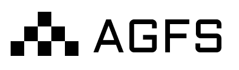

# 

[](https://opensource.org/licenses/Apache-2.0)
[](https://github.com/c4pt0r/agfs/actions/workflows/daily-build.yml)

**Aggregated File System (Agent FS)** - Everything is a file, in RESTful APIs. A tribute to Plan9.

## Why AGFS?

When coordinating multiple AI Agents in a distributed environment, agents need access to various backend services: message queues, databases, object storage, KV stores, and more. The traditional approach requires writing specialized API calls for each service, meaning agents must understand many different interfaces.

The core idea of AGFS is simple: **unify all services as file system operations**.

```
Traditional approach                    AGFS approach
------------------------------------------------------------------
redis.set("key", "value")          ->   echo "value" > /kvfs/keys/mykey
sqs.send_message(queue, msg)       ->   echo "msg" > /queuefs/q/enqueue
s3.put_object(bucket, key, data)   ->   cp file /s3fs/bucket/key
mysql.execute("SELECT ...")        ->   echo "SELECT ..." > /sqlfs2/.../query
```

The benefits:

1. **AI understands file operations natively** - Any LLM knows how to use cat, echo, and ls. No API documentation needed.
2. **Unified interface** - Operate all backends the same way, reducing cognitive overhead.
3. **Composability** - Combine services using pipes, redirections, and other shell features.
4. **Easy debugging** - Use ls and cat to inspect system state.

## Quick Start

Install:

```bash
curl -fsSL https://raw.githubusercontent.com/c4pt0r/agfs/master/install.sh | sh
```

Or via Docker:

```bash
docker pull c4pt0r/agfs-server:latest
```

Connect using agfs-shell:

```bash
$ agfs
agfs:/> ls
queuefs/  kvfs/  s3fs/  sqlfs/  heartbeatfs/  memfs/  ...
```

## FUSE Support

AGFS can be mounted as a native filesystem on Linux using FUSE. This allows any program to interact with AGFS services using standard file operations, not just the agfs-shell.

```bash
# Mount AGFS to /mnt/agfs
agfs-fuse --agfs-server-url http://localhost:8080 --mount /mnt/agfs

# Now use standard tools
ls /mnt/agfs/kvfs/keys/
echo "hello" > /mnt/agfs/kvfs/keys/mykey
cat /mnt/agfs/queuefs/tasks/dequeue
```

This makes AGFS accessible to any application, script, or programming language that can read and write files.

See [agfs-fuse/README.md](./agfs-fuse/README.md) for installation and usage.

## Examples

### Key-Value Store

The simplest key-value storage. Filename is the key, content is the value:

```bash
agfs:/> echo "world" > /kvfs/keys/hello      # write
agfs:/> cat /kvfs/keys/hello                  # read -> "world"
agfs:/> ls /kvfs/keys/                        # list all keys
hello
agfs:/> rm /kvfs/keys/hello                   # delete
```

### Message Queue

A message queue is abstracted as a directory containing control files:

```bash
agfs:/> mkdir /queuefs/tasks             # create queue
agfs:/> ls /queuefs/tasks
enqueue  dequeue  peek  size  clear

agfs:/> echo "job1" > /queuefs/tasks/enqueue    # enqueue
019aa869-1a20-7ca6-a77a-b081e24c0593

agfs:/> cat /queuefs/tasks/size                 # check queue length
1

agfs:/> cat /queuefs/tasks/dequeue              # dequeue
{"id":"019aa869-...","data":"job1","timestamp":"2025-11-21T13:54:11Z"}
```

This pattern is ideal for AI Agent task distribution: one agent writes tasks to the queue, another agent reads and executes them.

### SQL Database

Query databases through a Plan 9 style session interface:

```bash
agfs:/> cat /sqlfs2/mydb/users/schema       # view table structure
agfs:/> cat /sqlfs2/mydb/users/count        # get row count

# Create session, execute query, read result
agfs:/> sid=$(cat /sqlfs2/mydb/users/ctl)
agfs:/> echo "SELECT * FROM users LIMIT 2" > /sqlfs2/mydb/users/$sid/query
agfs:/> cat /sqlfs2/mydb/users/$sid/result
[{"id": 1, "name": "alice"}, {"id": 2, "name": "bob"}]
```

### Agent Heartbeat

Manage the liveness state of distributed agents:

```bash
agfs:/> mkdir /heartbeatfs/agent-1       # register agent
agfs:/> touch /heartbeatfs/agent-1/keepalive   # send heartbeat

agfs:/> cat /heartbeatfs/agent-1/ctl     # check status
last_heartbeat_ts: 2025-11-21T13:55:45-08:00
timeout: 30
status: alive

# After 30 seconds without a new heartbeat, the agent directory is automatically removed
```

### Cross-FS Operations

Different filesystems can operate with each other:

```bash
agfs:/> cp local:/tmp/data.txt /s3fs/mybucket/   # upload local file to S3
agfs:/> cp /s3fs/mybucket/config.json /memfs/    # copy S3 file to memory
```

## AGFS Scripts

AGFS shell supports scripting with `.as` files. Scripts use familiar shell syntax and can be executed directly.

**task_worker.as** - A simple task queue worker:

```bash
#!/usr/bin/env agfs

QUEUE_PATH=/queuefs/tasks
POLL_INTERVAL=2

# Initialize queue
mkdir $QUEUE_PATH

while true; do
    size=$(cat $QUEUE_PATH/size)

    if [ "$size" = "0" ]; then
        echo "Queue empty, waiting..."
        sleep $POLL_INTERVAL
        continue
    fi

    # Dequeue and process task
    task=$(cat $QUEUE_PATH/dequeue)
    echo "Processing: $task"

    # Your task logic here
done
```

**enqueue_task.as** - Enqueue a task:

```bash
#!/usr/bin/env agfs

mkdir /queuefs/tasks
echo "$1" > /queuefs/tasks/enqueue
echo "Task enqueued. Queue size: $(cat /queuefs/tasks/size)"
```

Run scripts directly:

```bash
./task_worker.as &
./enqueue_task.as "process report.pdf"
```

See more examples in [agfs-shell/examples](./agfs-shell/examples/).

## Use Case: AI Agent Task Loop

A typical agent coordination pattern: multiple agents fetch tasks from the same queue and execute them.

```python
while True:
    task = agfs.cat("/queuefs/tasks/dequeue")
    if task:
        result = execute_task(task)
        agfs.write(f"/kvfs/keys/result_{task.id}", result)
```

See [task_loop.py](./agfs-mcp/demos/task_loop.py) for a complete example.

## Documentation

- [agfs-server](./agfs-server/README.md) - Server configuration and plugin development
- [agfs-shell](./agfs-shell/README.md) - Interactive shell client
- [agfs-fuse](./agfs-fuse/README.md) - FUSE filesystem mount (Linux)
